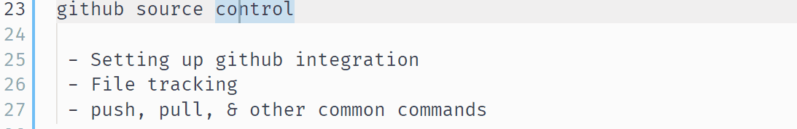
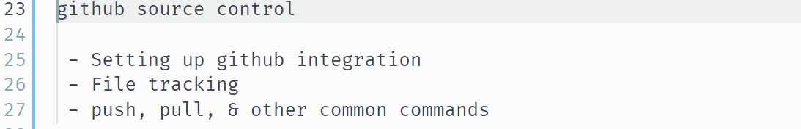

# VSC demo

This repo is to showcase some common uses of VSC. 

Software used to make gifs: [ScreenToGif](https://www.screentogif.com/)

## Contents

basic functionality
 - main windows
 - using multiple windows (even same file) 
 - go to definition
 - search               
 - replace all 
 - go to next instance  (alt+d)
 - line manipulation

github source control
 - Setting up github integration
 - File tracking
 - push, pull, & other common commands

extentions (customise VSC for your needs)
 - how to find & install
 - aesthetics
 - code snippets & boilerplate
 - galaxy
 - html
 - markdown
 - linting

aesthetics (from extensions)
 - color themes
 - bracket pair coloriser

debugging 
 - setting up a debug profile
 - variable window
 - breakpoint marking

tests
 - why tests?
 - writing tests
 - test reports

## Basic functionality

 

**Line manipulation**

lines can be moved up or down using `alt+🠕/🠗`

Lines can also be duplicated by adding `shift` to the above ( `shift+alt+🠕/🠗` ) 

Commenting and uncommenting lines is easy. Just use `ctrl+k+c` to comment, and `ctrl+k+u` to uncomment. VSC works out the correct way to comment the line depending on the type of file being worked on. 

