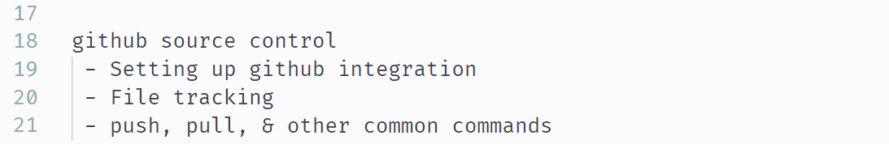

# VSC demo

This repo is to showcase some common uses of VSC. 
Software used to make gifs: [ScreenToGif](https://www.screentogif.com/)

## Contents

basic functionality
 - main windows
 - using multiple windows (even same file) 
 - search               
 - replace all 
 - line manipulation
 - go to next instance
 - go to definition

extentions (customise VSC for your needs)
 - how to find & install
 - code linting
 - aesthetics   (color themes, bracket pair coloriser)
 - markdown
 - galaxy

github source control
 - Setting up github integration
 - File tracking
 - push, pull, & other common commands

debugging 
 - setting up a debug profile
 - variable window
 - breakpoints 

tests
 - setting up test functionality
 - writing tests
 - test reports

Future plans
 - galaxy planemo test integration
 

## Basic functionality

 

**Line manipulation**

lines can be moved up or down using `alt+🠕/🠗`

Lines can also be duplicated by adding `shift` to the above ( `shift+alt+🠕/🠗` ) 

Commenting and uncommenting lines is easy. Just use `ctrl+k+c` to comment, and `ctrl+k+u` to uncomment. VSC works out the correct way to comment the line depending on the type of file being worked on. 

